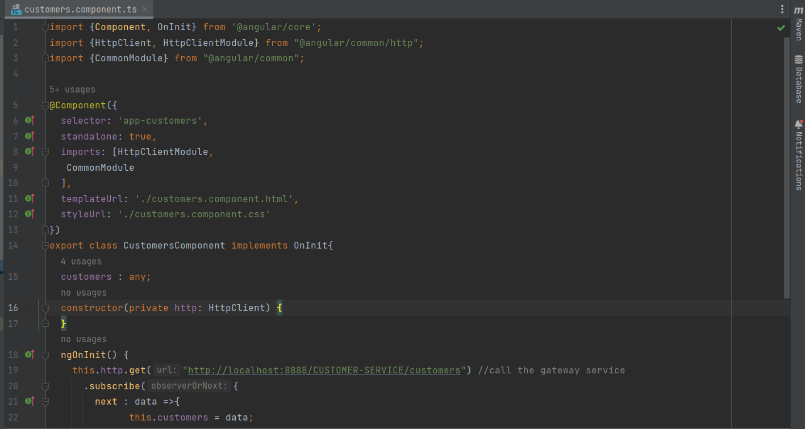
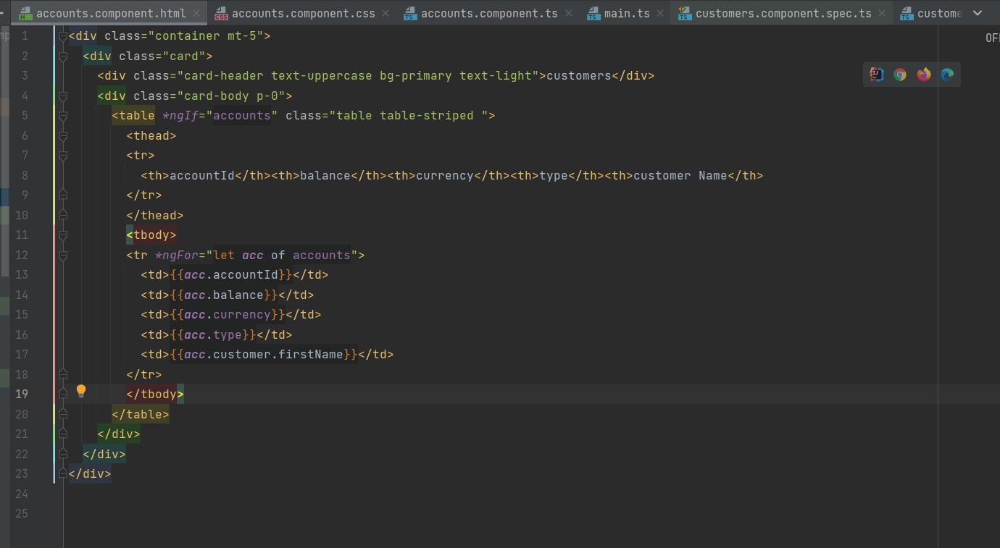

# e-bank-microservices

# eureka-service

# config-service

# customer-service
## swagger interface

## swagger test get customers

## angular customers.component.ts
make request to the gateway-service, then the gateway will forward the request to customer-service

## angular customers.component.html

## angular front menu

# accounts-service
## swagger interface

## swagger test get accounts

## angular accounts.component.ts
make request to the gateway-service, then the gateway will forward the request to account-service

## angular accounts.component.html

## angular front menu

